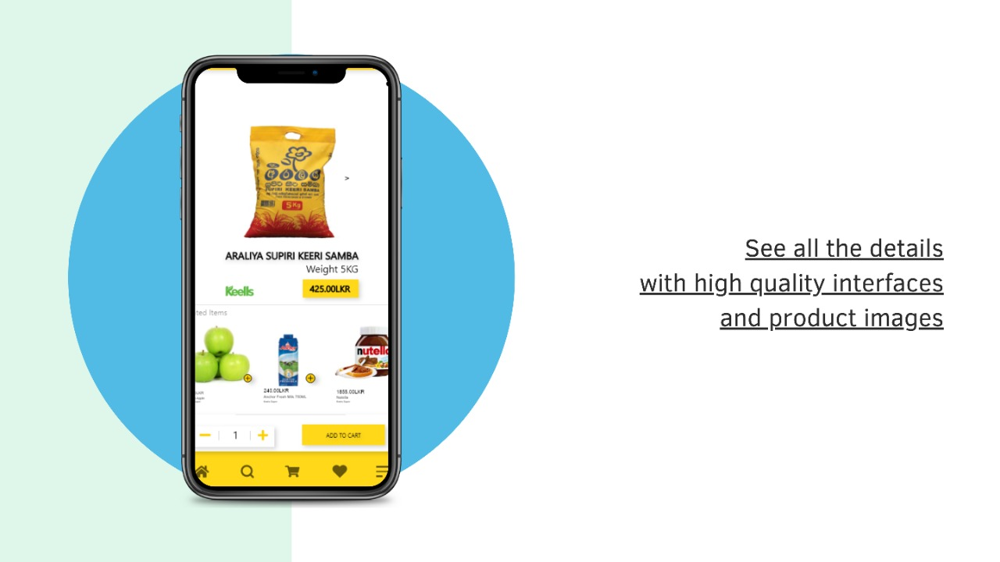

# Rush Delivery

A Food Delivery Application with Flutter and Firebase

## Group Members

| Name          | Student_ID           
| -------------    |:-------------:|
| K.G.M. Kumarasiri| 21085999 |
| N.N.S. Perera      | 21018588      |
| R S A Ranabahu | 21018299      |
| M.M.C.L. Marasinghe | 21019295      |
| S.C.Christy | 10026763     |

## Used Technologies

* Authentication with **Firebase Auth**
  * Sign up/ Sign In with Email and Password
  * Automatic Logout After some time

* **Firebase Realtime Database** as the Database
  * Store Product Data
  * Fetch Product Data
  * Fetch Orders
  * Add Orders for relevant User

* [Provider](https://pub.dev/packages/provider) for State Management
  * Shopping Cart
  * Wishlist

## Getting Started

This project is a starting point for a Flutter application.

A few resources to get you started if this is your first Flutter project:

- [Lab: Write your first Flutter app](https://flutter.dev/docs/get-started/codelab)
- [Cookbook: Useful Flutter samples](https://flutter.dev/docs/cookbook)

For help getting started with Flutter, view our
[online documentation](https://flutter.dev/docs), which offers tutorials,
samples, guidance on mobile development, and a full API reference.
